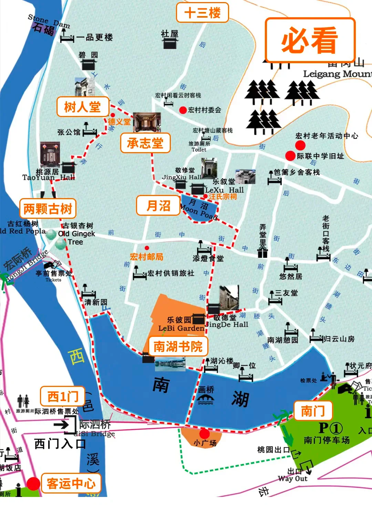
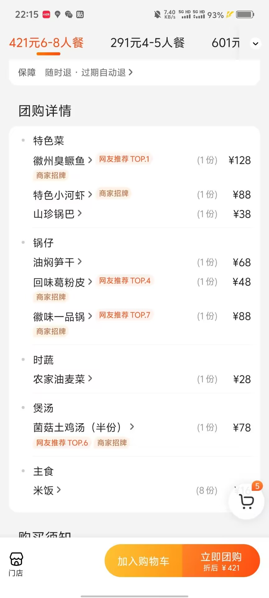
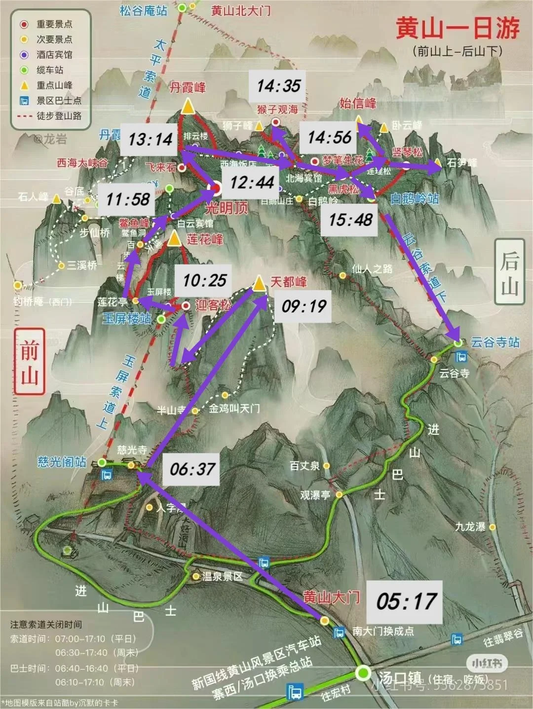

# 黄山旅游计划

## 12日

**出发**
乘坐11：28分的C3687复兴号列车，12：18到达黄山北站，随行吃携带泡面。

**宏村**
黄山北出站口右转到北站客运中心，最好坐12点半的车票价30元，直通宏村，时间1.5H
下面是两条可参考路线：
画桥➡南湖书院➡敬德堂➡月沼➡汪氏宗祠➡承志堂➡树人堂➡古树
南湖—南湖书院—月沼—承志堂—树人堂—桃源居—两棵古树—南湖

游玩时间14：00~18：00
出来之后，在门口的枫杨楼徽菜就餐，6~8人套餐，先吃爽

大约吃饭到19：00
就餐完毕之后，在附近超市，购买第二天喝的矿泉水，自热火锅等
晚上直接打车去酒店，总价100
酒店是比佳美民宿，价格是239，双人标间可住四人价格实惠，可以送至换乘中心

## 13日

**黄山**
1、早上5点20左右起床洗漱，5点50点乘坐酒店的接送前往南大门换乘中心坐换乘大巴（慈光阁方向，6:30开始运营）早去早排队

慈光阁➡天都峰（分叉口右侧）➡鲫鱼背➡迎客松➡莲花亭➡鳌鱼峰➡光明顶（这个中途游美食广场，可以吃自带的，也可以买）➡飞来石➡团结松➡猴子观海➡梦笔生花➡云谷索道
到达云谷寺站，乘坐大巴回换乘中心（南大门）
对面是客运站，走长途旅客进站口购票到黄山北，大约30一人
乘车返校

## 开销

去高铁票76 + 宏村门票52 + 当晚就餐105 + 住宿60 + 黄山门票（free） + 云谷索道80 + 景区巴士38 + 远途巴士30 + 返程76
76 + 52 + 105 + 60 + 80 +38 + 76 + 30 =517元。

## 注

1、登山杖提前购买，直接双十一购买、搭配一次性雨衣一件，暖宝宝、手套都是必须
2、门票提前买好
3、提前准备士力架等补充体力的小零食

## 门票购买

微信/支付宝关注黄山旅游官方平台，购买云谷索道下行票+景区换乘巴士+宏村三张票，巴士票可以现场买。
